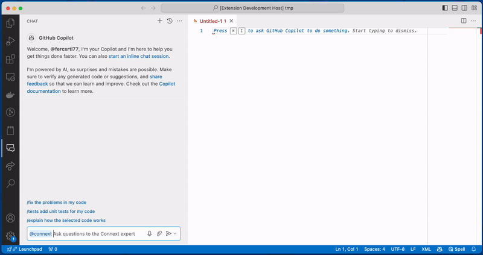
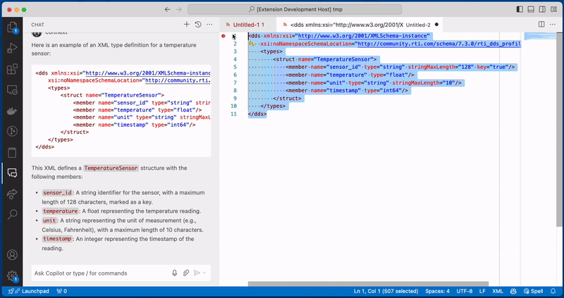
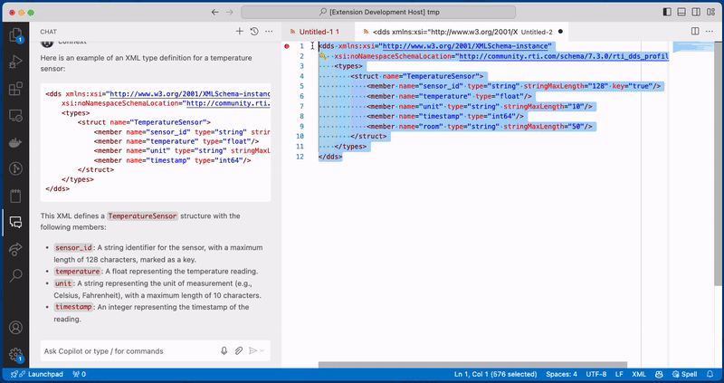

# Welcome to Connext for Github Copilot

This Visual Code extension brings the power of 
Connext Intelligence to Github Copilot Chat.

To access the Connext expert, simply type `@connext` followed by your 
question in the Copilot chat window. Once you type `@connext`, it will 
stay active allowing you to ask multiple questions without having to type 
`@connext` again.

## Requirements

To access the Connext expert, you need the following:

* An account on [Connext Intelligence](https://chatbot.rti.com/)
* A Copilot license

You will also need to install the GitHub Copilot Chat extension.

To use the Connext for Github Copilot extension, you need to login to your 
Connext Chatbot account.

You can do that by opening the command palette and selecting "Connext: Login".

You can log out of your Connext Chatbot account by opening the command palette 
and selecting "Connext: Logout".

If you do not log in, the Connext expert will ask you to log in when you try to 
ask a question.

## Features

**Chat View**: You can get assistance from the Connext expert directly in the 
Copilot chat window by typing `@connext` followed by your question.

**Quick Chat**: Initiate a brief conversation by opening Quick Chat with the 
"Chat: Open Quick Chat" command or by using the keyboard shortcut Ctrl+Shift+I 
or Cmd+Shift+I. This is useful for asking short, specific questions or getting 
quick help during coding—simply type `@connext` followed by your question in 
the chat window.

**Context menu**: You can obtain help from the Connext expert by right-clicking 
on a section of code, selecting "Connext" from the context menu, and choosing 
one of the available options.

## Chat Commands

This extension allows invoking pre-defined commands from the chat window by 
typing `@connext` followed by the `/<command>`.

The available commands are:

* `/connextInfo`: Displays information about the Connext versions installed
    on your system. If there are multiple versions installed, the expert will
    ask you to choose which one you want to use as the default.
* `/openFiles`: The Connext expert will consider all open files in the editor
    as part of the question context. This setting can also be toggled on and off
    in the extension settings.
* `/startAdminConsole`: Opens RTI Admin Console using the default installation.
* `/startSystemDesigner`: Opens the RTI System Designer using the default
    installation.
* `/startMonitorUI`: Opens the RTI Monitor UI using the default installation.
* `/startShapesDemo`: Starts the RTI Shapes Demo using the default installation.
* `/newExample`: It generates a new example project using the default
    installation for a type and language of your choice. It also allows you
    to change the publisher and subscriber code. This command uses the rtiddsgen
    tool to generate the code for the example. This command is great to 
    inspect and play with the generated code and see how it works.

The commands that start tools and generate a new example will fail if there is 
no default installation configured.
